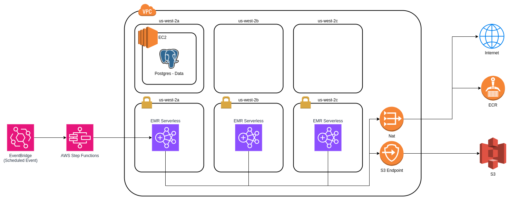
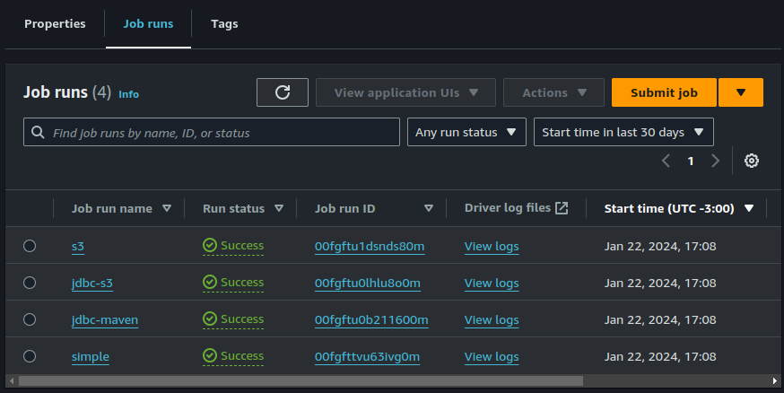

# EMR Serverless

This repository intends to provision all underline infrastructure in order to execute [Spark Jobs](https://spark.apache.org/) using [Amazon EMR Serverless](https://aws.amazon.com/emr/serverless/). Also it exemplifies how to execute simple Spark Jobs, how to handle Spark Dependencies and how to performed ordinary task like read from database and read/write from S3.




In order to perform theses ordinary task the follow scripts were developed:

- [`simple.py`](./python/scripts/simple.py) - Creates a Dataframe and uses Pandas printing the result.
- [`jdbc.py`](./python/scripts/jdbc.py) - Reads Data from a Postgres Database and prints the result. **Requires [Postgres Library](https://mvnrepository.com/artifact/org.postgresql/postgresql/42.7.1)**.
- [`s3.py`](./python/scripts/s3.py) - Reads Data from a CSV saved on S3, and saves it back after perform some transformations. 

To demonstrate how to handle dependencies the script [`jdbc.py`](./python/scripts/jdbc.py) is executed three times

- `jdbc-maven` - Download the dependencies directly from [Maven Repository](https://mvnrepository.com/) using the Spark config `--packages`.
- `jdbc-s3` - Download the dependencies previously upload on S3 using the Spark config `--jars`.
- `jdbc-s3-custom-docker-image` - Builds a Docker Image from this [Dockerfile](./Dockerfile) embedding the dependencies in this custom image and uses it to execute the job.

The Jobs submissions are performed by AWS EventBridge using scheduled events (**every 5 minutes**), that triggers the AWS Step Function which submits the jobs to EMR Serverless

> `Beware!!!` - Disable the eventbridge schedule events in order to not spent your money! Otherwise the trigger will spin up 5 jobs to EMR cluster every 5 minutes.

> If you would like to know how the jobs are submitted check this [script](./terraform/scripts/setup.sh).

## Requisites
---
- [Create an AWS Account](https://aws.amazon.com/)
- [Install AWS CLI](https://docs.aws.amazon.com/cli/latest/userguide/getting-started-install.html)
- [Configure AWS CLI](https://docs.aws.amazon.com/cli/latest/userguide/cli-authentication-user.html)
- [Install TF_ENV](https://github.com/tfutils/tfenv)
- [Configure Terraform AWS Authentication](https://registry.terraform.io/providers/hashicorp/aws/latest/docs#environment-variables)

## Running

In order to execute the application, run the following commands.

```bash
cd terraform
tfenv install
tfenv use
terraform init
terraform apply
```

## Running Locally

In order to run the scripts locally perform the following steps

- [Install PyEnv](https://github.com/pyenv/pyenv) - optional [link](https://realpython.com/intro-to-pyenv/)
- Run these commands:
```bash
# Application directory
cd python

# Installs the correct python version (3.9)
pyenv local

# Creates Python Virtual Environment
python -m venv .venv
source .venv/bin/activate

# Installs required libraries
pip install -r requirements.txt

# Executes the Script
python scripts/simple.py --local # Do not forget to pass the required arguments

```

## Results
---




## References
---

- [Tutorial](https://www.youtube.com/watch?v=grfSNj2EMwo&ab_channel=JohnnyChivers)
- [EMR Containers Best Practices](https://aws.github.io/aws-emr-containers-best-practices/)
- [EMR Containers Examples](https://github.com/aws-samples/emr-serverless-samples)
